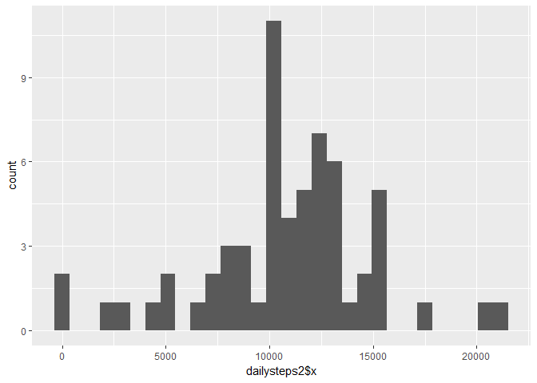

Reproducible Research\_Project1
================
Pat Mitoraj
October 7, 2017

Loading and Preprocessing the Data
----------------------------------

The code below downloads the file, unzips the content, and loads the "activity.csv" file. Additionally, the ggplot2 and plyer libraries are loaded.

``` r
library(ggplot2)
library(plyr)
df<-read.csv("activity.csv")
head(df)
```

    ##   steps       date interval
    ## 1    NA 2012-10-01        0
    ## 2    NA 2012-10-01        5
    ## 3    NA 2012-10-01       10
    ## 4    NA 2012-10-01       15
    ## 5    NA 2012-10-01       20
    ## 6    NA 2012-10-01       25

What is mean total number of steps taken per day?
-------------------------------------------------

The code below calculates the total number of steps taken per day

``` r
dailysteps=aggregate(df$steps, by=list(date=df$date), FUN=sum, na.rm=TRUE)
head(dailysteps)
```

    ##         date     x
    ## 1 2012-10-01     0
    ## 2 2012-10-02   126
    ## 3 2012-10-03 11352
    ## 4 2012-10-04 12116
    ## 5 2012-10-05 13294
    ## 6 2012-10-06 15420

This histogram shows the average number of steps taken per day

``` r
qplot(dailysteps$x, geom="histogram") 
```

    ## `stat_bin()` using `bins = 30`. Pick better value with `binwidth`.


The mean number of steps per day is 9354.23 and the median is 10395

``` r
mean(dailysteps$x)
```

    ## [1] 9354.23

``` r
median(dailysteps$x)
```

    ## [1] 10395

What is the average daily activity pattern?
-------------------------------------------

The following code calculates the average number of steps per five minute interval and plots the values in a histogram

``` r
timesteps=aggregate(df$steps, by=list(interval=df$interval), FUN=mean, na.rm=TRUE)
ggplot(timesteps, aes(timesteps$interval, timesteps$x)) + geom_line() + xlab("Time Inteval") + ylab("Average Steps")
```

 The interval 835 has the highest average number of steps

``` r
timesteps[which.max(timesteps$x),]
```

    ##     interval        x
    ## 104      835 206.1698

Imputing missing values
-----------------------

In total, there are 2304 missing values in the dataset

``` r
table(is.na(df))
```

    ## 
    ## FALSE  TRUE 
    ## 50400  2304

My strategy for filling in the NAs was to impute the missing step values with the average 5-minute interval based on the day of the week. The following code adds a day column to the original dataset, then separates the NA values from the rest of the table. The NA table values are then replaced with the average steps based on the 5 minute interval and the day of the week. Finally the two tables are merged into a new dataset with the missing values replaced.

``` r
df$day <- weekdays(as.Date(df$date))
df$DateTime<- as.POSIXct(df$date, format="%Y-%m-%d")
clean <- df[!is.na(df$steps),]
avgTable <- ddply(clean, .(interval, day), summarize, Avg = mean(steps))
nadata<- df[is.na(df$steps),]
newdata<-merge(nadata, avgTable, by=c("interval", "day"))
newdata2<- newdata[,c(6,4,1,2,5)]
colnames(newdata2)<- c("steps", "date", "interval", "day", "DateTime")
mergeData <- rbind(clean, newdata2)
head(mergeData)
```

    ##     steps       date interval     day   DateTime
    ## 289     0 2012-10-02        0 Tuesday 2012-10-02
    ## 290     0 2012-10-02        5 Tuesday 2012-10-02
    ## 291     0 2012-10-02       10 Tuesday 2012-10-02
    ## 292     0 2012-10-02       15 Tuesday 2012-10-02
    ## 293     0 2012-10-02       20 Tuesday 2012-10-02
    ## 294     0 2012-10-02       25 Tuesday 2012-10-02

The mean and median of this new dataset are both higher than the dataset with the missing values

``` r
dailysteps2=aggregate(mergeData$steps, by=list(date=mergeData$date), FUN=sum, na.rm=TRUE)
qplot(dailysteps2$x, geom="histogram") 
```

    ## `stat_bin()` using `bins = 30`. Pick better value with `binwidth`.



``` r
mean(dailysteps2$x)
```

    ## [1] 10821.21

``` r
median(dailysteps2$x)
```

    ## [1] 11015

Are there differences in activity patterns between weekdays and weekends?
-------------------------------------------------------------------------

the following code adds a new column identifying whether a day is on the weekend or is a weekday, then averages the number of steps by day type and time interval.

``` r
mergeData$DayCategory <- ifelse(mergeData$day %in% c("Saturday", "Sunday"), "Weekend", "Weekday")
daytypeAve=aggregate(cbind(steps)~DayCategory+interval, data=mergeData, 
mean, na.rm=TRUE)
```

The plot below shows that the avergae number of stpes on weekdays and the weekend.

``` r
ggplot(daytypeAve,aes(x=interval, y=steps)) +geom_line() +facet_wrap(~DayCategory)
```


